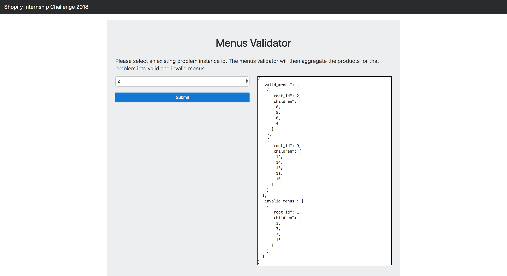
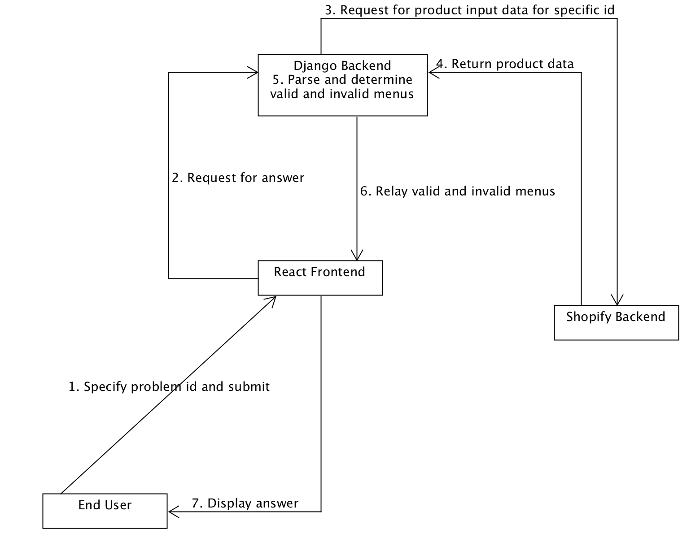

#  Shopify Summer Internship Coding Challenge 2018
[](https://travis-ci.org/apoorvkk/Shopify-Software-Engineering-Challenge)



# Summary
[Shopify's Sofware Engineering Challenge](https://backend-challenge-summer-2018.herokuapp.com/) required me to create a program that will aggregate a list of given related products into valid and invalid menus. Invalid menus were those that had cyclic references between products (an item on a menu) or a menu that had a max depth greater than 4. This project will allow merchants who have different products to easily present the products through organised, valid and clean menus.

# Project Approach

I have produced two versions of this project. The first is a `Python` program that can be run in the terminal ([Command Line Interface Version](#command-line-interface-version)).

As I made the first program very modular, I was able to ***port the first program*** into a web application ([Web Application Version](#web-application-version)). The web application is hosted on Heroku and S3.

Both project versions have been outlined below. I have documented how to install, test and lint the programs locally.

### Application Specific Design (Menus Validation)

I iteratively request for input products (iterating through each page) from the given backend service and parse the data into a dictionary such that each key map to each product id. Using a dictionary will allow access to objects in constant time. As I parse each product response data into this dictionary, I also identify and keep a list of root ids. If we truly have valid menus **only**, each root id will map to a unique tree where the nodes in each tree do not connect to any other nodes from other trees. From here, I conducted a depth first search on each root id collected to validate each menu (or also known as a tree here).

To detect if there is a cyclic reference, I check if any of the neighbouring nodes of the current node have already been visited **and** if there is **no** parent reference from a neighbouring node back to the current node. A cyclic reference can only happen when two parent nodes claim a child node as their own child (this is assuming that there is a root node with no parent reference).  To detect if the menu is invalid by max depth reached, I keep track of the current depth as I traverse through each node in the tree.

After determining the valid and invalid menus, I output the answer in the expected `json` structure.

### Web Application Architecture Overview Design
# 


### Assumptions Made
There were a number of assumptions that had to be made during development:
1. The outputted `children` array for each outputted menu can have any order.
2. The depth of a node is ***the number of edges from the node to the tree's root node***. A root node will have a depth of 0.
3. The `root_id` will only be included in the `children` array for each outputted menu ***if there is a cyclic reference to the root node***.
4. The `per_page` attribute inside `pagination` in the response from Shopify's backend system will remain constant.
5. `id` and `page` will only be whole numbers.

# Common Installation and Setup

These are instruction to **setup both versions of the project** ([Web Application Version](#web-application-version) and [Command Line Interface Version](#command-line-interface-version)).

**Note**: This installation works best on Mac/Linux environments.

Requirements:

- `git`
- `python3.6.4`, `pip`
- `virtualenv` - `pip install virtualenv`
- `node 6.9.1` or higher.
- `npm 3.10.8` or higher.

### STEP ONE - Setting Up Virtual Environment

Open up your terminal and go into an empty directory of choice. Run the command below to create a virtual environment:
```
virtualenv -p python3 ShopifyEnv
```

From here, run the two commands below to **activate** the newly created virtual environment:
```
cd ShopifyEnv
source bin/activate
```

The virtual environment has now been activated and all dependencies will be installed inside here.

**Note**: You can exit the virtual environment by using the `deactivate` command.

### STEP TWO - Import Project Source Code

Now that we have the virtual environment **activated**, run the command below to load the project:
```
git clone https://github.com/apoorvkk/Shopify-Software-Engineering-Challenge.git
```

### STEP THREE - Install Python Packages
Run the commands below to locate the `requirements.txt` and install `python` dependencies:
```
cd Shopify-Software-Engineering-Challenge/
pip install -r requirements.txt
```

**Note**: If `pip` does not work, please try `pip3`.

### STEP FOUR - Install Node Packages
Run the command below to locate the `package.json` and install dependencies:
```
cd MenuValidator/frontendapp/
npm install
```

# Command Line Interface Version
**Note**: If not completed already, please follow [Common Installation and Setup](#common-installation-and-setup) first before running/testing/linting any **local** applications.

The actual source code for this project version is in (assuming you are at the root of the `git` repository):
```
MenusValidator/cli/
```

### Running the Application
Locate yourself inside the root of `Shopify-Software-Engineering-Challenge/` `git` repository if not done already. Ensure you have **activated** your virtual environment (see [Common Installation and Setup](#common-installation-and-setup)).

Run the commands below:
```
cd MenuValidator/cli/
python main.py
```
**Note:** You might need to use `python3` command if `python` does not work.

You will be prompted to provide the `problem id` so input the selected problem of choice. As it stands from `09/01/18`, there are currently two different problems (`id=1` for the standard challenge and `id=2` for the extra challenge).

### Testing the Application
Locate yourself inside the root of `Shopify-Software-Engineering-Challenge/` `git` repository if not done already. Ensure you have **activated** your virtual environment (see [Common Installation and Setup](#common-installation-and-setup)).

Run the commands below:
```
cd MenuValidator/cli/
python -m unittest discover menus/
```
**Note:** You might need to use `python3` command if `python` does not work.

### Linting the Application
Locate yourself inside the root of `Shopify-Software-Engineering-Challenge/` `git` repository if not done already. Ensure you have **activated** your virtual environment (see [Common Installation and Setup](#common-installation-and-setup)).

The application follows the PEP8 standard. Please run the commands below:
```
cd MenuValidator/cli/
flake8
```

# Web Application Version

**Note**: If not completed already, please follow [Common Installation and Setup](#common-installation-and-setup) first before running/testing/linting any **local** applications.

The actual source code for this project version are in (assuming you are at the root of the `git` repository):
```
MenusValidator/
```
This includes the frontend app, backend app (which contains the cli project version).

### Running the Application

To run the local backend application (`django`) **and** local frontend application (`react`), **please read on**.

##### Local Backend Application (django)
Open up a fresh terminal and locate yourself inside the root of `Shopify-Software-Engineering-Challenge/` `git` repository if not done already. Ensure you have **activated** your virtual environment (see [Common Installation and Setup](#common-installation-and-setup)).

Run the commands below:
```
cd MenuValidator/
python manage.py runserver
```
**Note:** You might need to use `python3` command if `python` does not work. Also, ensure that port `8000` is free.

This should load up the backend application into a local webserver.
Open up a browser and enter this url:

```
http://localhost:8000/fetch-menus?problem-id=1
```

You should see a `json` response with the answer to the first backend challenge problem. Change `problem-id` query parameter to another number (eg. 2 for the extra challenge) to run other available problems.


##### Local Frontend Application (react)
Open up a fresh terminal and locate yourself inside the root of `Shopify-Software-Engineering-Challenge/` `git` repository if not done already.
Run the commands below:
```
cd MenuValidator/frontendapp/
npm start
```
**Note:** Ensure port 3000 is available and that you have the node packages installed (`npm install`).

From the root of the `git` repository, access `MenuValidator/frontendapp/src/actions/ProblemSender.js` and modify the `url` constant to be:
```
const url  = `http://localhost:8000/fetch-menus?problem-id=${problemId.toString()}`;
```

Then try to run the frontend application. It should now connect to the local backend application rather than the hosted version.

### Linting the Application
Locate yourself inside the root of `Shopify-Software-Engineering-Challenge/` `git` repository if not done already. Ensure you are inside your virtual environment (see [Common Installation and Setup](#common-installation-and-setup)).

The application follows the PEP8 standard. Please run the commands below:
```
flake8 --exclude=*/frontendapp/*
```


# Stack and Tools Used
#### Application Specific
- [python 3.6.4](https://www.python.org/downloads/release/python-364/)
- [flake8 3.5.0](http://flake8.pycqa.org/en/latest/)
- [unittest](https://pypi.python.org/pypi/unittest2)
- [requests](http://docs.python-requests.org/en/master/)

#### Backend
- [python 3.6.4](https://www.python.org/downloads/release/python-364/)
- [django 2.0.1](https://www.djangoproject.com/)
- [djangorestframework 3.7.7](http://www.django-rest-framework.org/)
- [gunicorn](http://gunicorn.org/)


#### Frontend
- [Javascript](https://www.javascript.com/)
- [react 16.2.0](https://reactjs.org/)
- [redux 3.7.2](https://redux.js.org/docs/introduction/)
- [react-redux 5.0.6](https://github.com/reactjs/react-redux)
- [axios 0.17.1](https://www.axios.com/)
- [bootstrap 4](https://v4-alpha.getbootstrap.com/)

#### Misc
- [Github](https://github.com/)
- [Travis CI](https://travis-ci.org/)
- [Heroku](https://www.heroku.com/)
